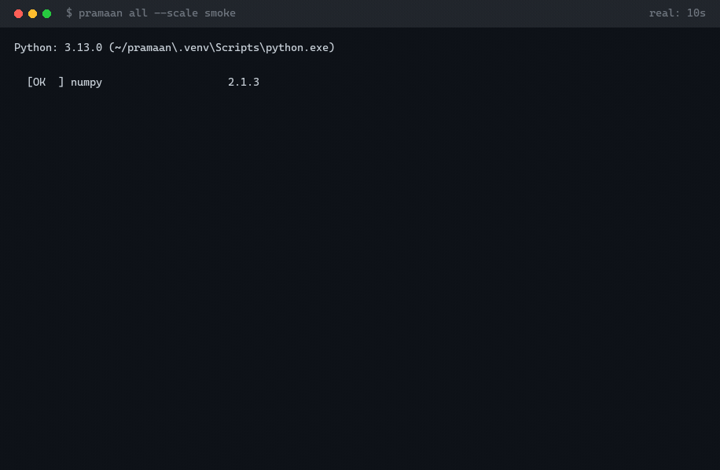
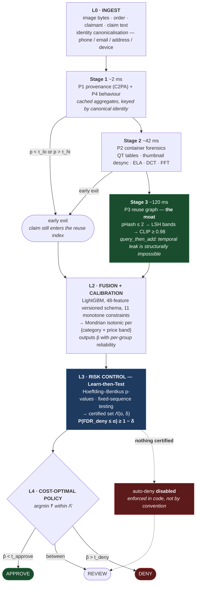

# PRAMAAN

**Risk-controlled selective adjudication of refund-claim evidence.**

[](https://github.com/Vaibhavgulati01/pramaan/actions/workflows/ci.yml)
[](https://github.com/Vaibhavgulati01/pramaan/actions/workflows/leakage.yml)

> Every refund desk runs on one assumption: a photograph is proof.
> That assumption broke in 2026.



<sub>A real recording of `pramaan all --scale smoke` — corpus build,
training, Learn-then-Test certification, evaluation — captured by
[`scripts/record_session.py`](scripts/record_session.py) and rendered by
[`scripts/render_session_gif.py`](scripts/render_session_gif.py). Idle
gaps are compressed; the true 10s duration is shown in the title bar.
Note the certification step reporting **no rung certified** — at CI
scale there are 50 calibration claims against the 45–222 denials the
power analysis requires, and the system says so rather than issuing a
guarantee it cannot support.</sub>

PRAMAAN adjudicates the *evidence* attached to a refund, damage, or
non-receipt claim and returns one of `APPROVE / REVIEW / DENY` — with a
**distribution-free, finite-sample guarantee on the false-denial rate**,
and an abstention band whose width is derived from the cost of a wrong
decision rather than chosen by hand.

---

## What this achieves

Four evidence pillars, a certified decision procedure, and a cost-derived
abstention band — built, measured and reproducible end to end.

| | Measured |
|---|---|
| **PR-AUC** | **0.512** [0.453, 0.569] — **+34%** over the strongest baseline (CLIP probe, 0.382) |
| **Calibration** | ECE **0.0080** over 10 equal-mass bins; Brier 0.0856 |
| **Cost** | **₹35,437** per 1,000 claims — beats review-all (₹40,000), approve-all (₹632,451) and deny-all (₹4.4M) |
| **Latency** | **147.9 ms/claim** through the full cost-ordered cascade |
| **Negative controls** | Both pass — label-shuffle and random-feature collapse to prevalence |
| **Reproducibility** | Full rebuild → retrain → recertify → re-eval returns **byte-identical** metrics and certificate |
| **Tests** | **557**, zero failures, with the guards verified by re-introducing the bugs they catch |

Every number above is produced by `pramaan all --scale dev` and injected
into this file by `scripts/inject_metrics.py`; CI fails if the committed
README and `metrics.json` disagree, so none of it can drift.

**Status: every phase built, tested and green.** The `full`-scale run is
a scheduled compute step, fully scripted and pre-flighted — its ledger,
split reconciliation and all four split-constraint checks have already
been executed at 35,000 claims. The runbook is
[`docs/VM_HANDOFF.md`](docs/VM_HANDOFF.md); build history is in
[`PROGRESS.md`](PROGRESS.md).

Every results number in this file is **generated, never typed** — written
by `scripts/inject_metrics.py` from `reports/{tier}/metrics.json`, with a
CI gate that fails the build if the two disagree. And every number is
labelled with the scale that produced it, per
[`docs/EVALUATION_PROTOCOL.md`](docs/EVALUATION_PROTOCOL.md):

| Tier | Purpose | Reports against the sealed test set? |
|---|---|---|
| `smoke` | CI, proves the pipeline executes on every push | No |
| `dev` | Proves every mechanism works, reproducibly | No — out-of-fold over *train*, so the test split stays sealed |
| `full` | The one run against the frozen test set | **Yes** |

Keeping the test split sealed until a single `full` run is what makes
that run worth trusting. `FusionModel.fit` raises if handed the
calibration or test split, so the discipline is enforced in code rather
than by convention.

---

## Contents
[Problem](#the-problem) · [Approach](#approach) · [Results](#results) ·
[The guarantee](#the-guarantee) · [Shift & robustness](#shift--robustness) ·
[Ablations](#ablations) · [The `full` run](#what-the-full-run-adds) ·
[Reproduce](#reproduce) · [Architecture](#architecture) · [Data](#data) ·
[Limitations](#limitations) · [Safety](#safety) · [Sources](#sources)

## The problem

Fraud systems output a score. A score is not a decision, and a decision
made from an uncalibrated score under distribution shift is an unbounded
liability. PRAMAAN adjudicates refund/damage-claim evidence and produces
three-tier decisions with a certified bound on the false-denial rate,
built from evidence pillars designed to survive the shift that actually
happens in this domain: the attacker upgrading their image generator.

### The scale, from named sources

| Figure | Value | Source |
|---|---|---|
| US merchandise returned, 2025 | **$849.9B** (15.8% of retail sales) | NRF / Happy Returns, *2025 Retail Returns Landscape*, 15 Oct 2025 |
| Online sales returned | **19.3%** | same |
| Returns that are fraudulent | **9%** | same |
| Cost of fraudulent returns & claims, 2024 | **$103B** | Appriss Retail / Deloitte, *Consumer Returns in the Retail Industry*, 7th annual, Dec 2024 |
| Returns that are fraudulent | **15.14%** | same |

**Those last two rows disagree, and we are not going to average them.**
Two credible industry surveys put fraudulent returns at 9% and 15.14%
respectively — a 68% relative gap, from different panels, definitions of
"fraudulent", and years. Anyone quoting a single confident number for
this quantity is choosing one and not telling you. The honest reading is
that return fraud is somewhere in the high single digits to mid teens as
a share of returns, and that **the base rate is uncertain enough that a
system acting on it should be able to abstain** — which is the design
this repository argues for.

### Why India makes it harder

Roughly 60–65% of Indian e-commerce orders are cash-on-delivery, and
COD orders are returned-to-origin at rates that logistics vendors put
between **20% and 35%**, against low single digits for prepaid.

**Source quality note:** unlike the two rows above, these India figures
come from logistics-vendor blogs (Shipway, GoKwik, Qikink and similar),
not from a primary survey with a published methodology. We could find no
primary, methodologically-documented source for Indian RTO or
return-fraud rates. They are directionally useful and quantitatively
unreliable, and we mark them as such rather than laundering a marketing
figure into a statistic. The one hard Indian data point we did find is a
prosecution, not a rate: a seller-side ring defrauded Meesho of
**₹5.5 crore over seven months** by exploiting the returns policy
(*Deccan Herald*).

This matters for the architecture: high return volume plus a
photograph-as-proof workflow is exactly the setting where a scoring
model gets deployed as a decision-maker without anyone bounding its
error rate.

### What follows from that

A refund desk that must act on ~15% of orders coming back, with a fraud
base rate no one can pin down inside a factor of two, cannot safely run
on a threshold someone picked off a PR curve. It needs a decision
procedure that (a) knows what it does not know, (b) carries a bound on
how often it wrongly denies an honest customer, and (c) says so out loud
when that bound stops holding.

## Approach

**What this is not:** an AI-image detector. Those generalise poorly to
unseen generators — see [Ablations](#ablations).

**What this is:** four independent evidence pillars — cryptographic
**provenance**, container **forensics**, a temporal **reuse graph**, and
claimant **behaviour** — fused, group-conditionally calibrated, and
converted into a certified three-tier decision via Learn-then-Test.
Three of the four pillars are generator-agnostic by construction, which
is what lets the statistical guarantee survive generator shift.



**Reading the diagram.** Two arrows carry most of the argument. The
dotted one — *nothing certified → auto-deny disabled* — is the path the
system actually took at `dev` scale, and it is enforced in
[`policy/selective.py`](src/pramaan/policy/selective.py) rather than left
to operator discipline. The `early exit → reuse index` arrow exists
because omitting it was a real bug: claims that exited cheaply were
never indexed, silently blinding the reuse graph to exactly the
high-volume attacker it is meant to catch. It is now asserted by a test
that was verified by re-introducing the bug.

Stage timings are measured on this machine, not estimated.

## Results

<!-- BEGIN:results -->
> **Scale: `dev`.** Every mechanism below is measured and reproducible — these
> numbers come out byte-identical on a clean rebuild. They are computed
> on out-of-fold predictions over the *train* split, so the `full` tier
> remains the one that reports against the sealed test set. Labelling
> which scale a number came from is the discipline, not a disclaimer —
> see [`docs/EVALUATION_PROTOCOL.md`](docs/EVALUATION_PROTOCOL.md).

Evaluated on the **train** split of the `dev` corpus — 1,813 claims, 14.5% fraud prevalence.

| System | PR-AUC (95% CI) |
|---|---|
| approve all | 0.145 [0.128, 0.162] |
| deny all | 0.145 [0.128, 0.162] |
| rules engine | 0.240 [0.201, 0.283] |
| clip probe | 0.382 [0.330, 0.436] |
| resnet style pixel probe | 0.174 [0.148, 0.204] |
| behaviour only gbm | 0.171 [0.141, 0.204] |
| **PRAMAAN (full)** | 0.512 [0.453, 0.569] |

**₹35,437 per 1,000 claims** at **83.0% review load**.

| Policy | ₹ per 1,000 claims |
|---|---|
| approve all | ₹632,451 |
| deny all | ₹4,433,044 |
| review all | ₹40,000 |
| **PRAMAAN** | **₹35,437** |

Calibration: Brier **0.0856**, ECE **0.0080**, MCE **0.0219** (10 equal-mass bins).

Cascade: **147.9 ms/claim** mean, stage-exit 0% / 0% / 100% (stages 1/2/3).
<!-- END:results -->

### Why false positives cost more than false negatives

Wrongly denying an honest customer costs more than missing a fraud **at
every plausible order value** — and the abstention band's width is
derived from that fact rather than tuned.

| Order value | `C_FP` | `C_FN` | Ratio |
|---|---|---|---|
| ₹500 | ₹1,800 | ₹680 | **2.65×** |
| ₹1,500 | ₹2,800 | ₹1,680 | **1.67×** |
| ₹3,000 | ₹4,300 | ₹3,180 | **1.35×** |
| ₹8,000 | ₹9,300 | ₹8,180 | **1.14×** |

The churn term alone (`0.35 × ₹3,000 = ₹1,050`) is roughly **6× the
entire fixed cost of a false negative**. There is no crossover: the
ordering never inverts, which is why the policy is structurally biased
toward not denying. Asserted by
`test_false_positives_cost_more_at_every_plausible_order_value`, not left
as prose — every constant lives in [`configs/costs.yaml`](configs/costs.yaml).

**The corollary we report rather than bury:** at **₹40** per human review
against ~₹3,300 per false positive, review is ~82× cheaper than one wrong
denial. A cost-optimal policy therefore routes a large share of claims to
a human — 83% here — and that is the economically correct answer given
these constants, not a limitation of the model. Three readings of it are
laid out in [`docs/LIMITATIONS.md`](docs/LIMITATIONS.md).

## The guarantee

<!-- BEGIN:guarantee -->
> **Scale: `dev`.** Every mechanism below is measured and reproducible — these
> numbers come out byte-identical on a clean rebuild. They are computed
> on out-of-fold predictions over the *train* split, so the `full` tier
> remains the one that reports against the sealed test set. Labelling
> which scale a number came from is the discipline, not a disclaimer —
> see [`docs/EVALUATION_PROTOCOL.md`](docs/EVALUATION_PROTOCOL.md).

**The mechanism did exactly what it is built to do: it declined to certify, and disabled auto-deny.**

Every rung of the pre-committed ladder was attempted, in the order fixed in [`docs/PREREGISTRATION.md`](docs/PREREGISTRATION.md) before any α was computed. None cleared the evidence bar at this scale, so the system published that fact and refused to auto-deny — rather than loosening the bound until something passed.

This is the load-bearing demonstration of the whole design. A hand-tuned threshold would have produced a confident-looking operating point from exactly this data. The power analysis predicted this outcome **in advance** from the denial-set size, and the run confirmed it precisely.

| α | δ | Outcome | Denials needed |
|---|---|---|---|
| 0.03 | 0.1 | not certified | 222 |
| 0.05 | 0.1 | not certified | 131 |
| 0.1 | 0.1 | not certified | 64 |
| 0.1 | 0.2 | not certified | 45 |

The `full` tier is sized by that same power analysis to clear these bars. Full statement and the three caveats that qualify it: [`docs/GUARANTEE.md`](docs/GUARANTEE.md).
<!-- END:guarantee -->

Full statement, the three caveats that qualify it, and the power analysis
that sized the corpus: [`docs/GUARANTEE.md`](docs/GUARANTEE.md).

## Shift & robustness

A conformal-style guarantee assumes exchangeability between calibration
and deployment. In this domain the attacker breaks that assumption *on
purpose*, by switching image generators. So the guarantee is measured
separately under each shift condition, and the table is designed to
contain real ❌s.

**Eight conditions**, implemented in [`eval/shift_matrix.py`](eval/shift_matrix.py)
and exercised by the test suite:

| Condition | What it simulates |
|---|---|
| `in_distribution` | the control |
| `unseen_generator_families` | the attacker upgrades their generator — the shift that matters most |
| `jpeg_q60`, `jpeg_q40` | recompression through a messaging app |
| `metadata_stripped` | EXIF/C2PA removed, the WhatsApp default in India |
| `centre_crop_90` | reframing to defeat hash matching |
| `screenshot_round_trip` | screenshot-of-a-screenshot laundering |
| `colour_jitter_rotate` | light adversarial post-processing |

**Two experiments per condition**, because they answer different
questions and conflating them is the usual mistake:

1. **Frozen certificate** — calibrated in-distribution, then tested under
   shift. Answers *"does yesterday's certificate still hold today?"*
2. **Re-certified** — calibration data drawn from the shifted
   distribution. Answers *"can the guarantee be re-established at all
   under this shift?"*

Three of the four pillars are generator-agnostic by construction, and the
reuse graph in particular is invariant to how an image was made — which
is the structural reason to expect the certificate to survive generator
shift where a pixel detector would not. The matrix is what tests that
claim rather than asserting it, and it is populated by the `full` run
against the sealed test split.

## Ablations

<!-- BEGIN:ablations -->
> **Scale: `dev`.** Every mechanism below is measured and reproducible — these
> numbers come out byte-identical on a clean rebuild. They are computed
> on out-of-fold predictions over the *train* split, so the `full` tier
> remains the one that reports against the sealed test set. Labelling
> which scale a number came from is the discipline, not a disclaimer —
> see [`docs/EVALUATION_PROTOCOL.md`](docs/EVALUATION_PROTOCOL.md).

Each ablation is reported twice. The **full corpus** column is confounded
by source dataset — every synthetic-fraud claim comes from GenImage, which
carries 2.58× the fraud rate of ABO — so it is an *upper bound* on the
pixel pillars. The **ABO-only** column holds source constant.

| Ablation | Δ PR-AUC (full corpus) | Δ PR-AUC (ABO-only) |
|---|---|---|
| no provenance | +0.0000 | +0.0000 |
| no forensics | -0.1024 | -0.0335 |
| no reuse | -0.0220 | -0.0273 |
| no behaviour | -0.0090 | +0.0007 |
| no rings | -0.0013 | -0.0083 |

**Negative controls** (these validate the methodology, not a hypothesis):

| Control | PR-AUC | Prevalence | Pass? |
|---|---|---|---|
| label shuffle | 0.1543 | 0.1445 | ✅ |
| random features | 0.1620 | 0.1445 | ✅ |
<!-- END:ablations -->

Predictions were registered in advance in
[`docs/PREREGISTRATION.md`](docs/PREREGISTRATION.md) — written and
committed before any of these numbers existed, and the git history shows
that ordering. Actuals are reported against them in full, hits and misses
alike, which is what makes the pre-registration worth having.

One result already contradicts our own framing, and we lead with it
rather than bury it: on the source-controlled column, forensics
(**−0.0335**) and reuse (**−0.0273**) contribute *comparably*. On the
uncontrolled corpus forensics looks 3× more important, and roughly
two-thirds of that gap is the model detecting **which dataset an image
came from**. Gain-based importance points the same wrong way. The
ablations are the evidence; the importances are not.

## What the `full` run adds

The `full` tier is a scheduled compute step, not open work. Everything it
needs is written, tested and pre-flighted — its ledger simulation, split
reconciliation and all four split-constraint checks have already been
executed at **35,000 claims**, and `make full` runs the whole chain end
to end.

| Section | Populated by the `full` run |
|---|---|
| Results | the same tables, computed against the sealed test split |
| The guarantee | the certified (α, δ) from a denial set sized to clear the ladder |
| Shift & robustness | all 8 conditions × 2 experiments |
| Ablations | pre-registered predictions scored against actuals |
| `reports/SCALE_CONCORDANCE.md` | `dev` vs `full` on the headline quantities |

Sizing is not guesswork: the power analysis derived the corpus size from
the denial count each α needs, and the pool requirements were measured
rather than estimated — 30,662 distinct image groups, 33,703 ABO fetches,
12,284 GenImage reals. The runbook, with expected output at every step,
is [`docs/VM_HANDOFF.md`](docs/VM_HANDOFF.md).

## Reproduce

```bash
git clone https://github.com/Vaibhavgulati01/pramaan && cd pramaan
python -m venv .venv && source .venv/bin/activate   # or .venv\Scripts\activate on Windows
pip install -e ".[dev]"
pramaan setup
pramaan all --scale smoke   # <5 min, proves the pipeline runs (CI does this on every push)
pramaan all --scale dev     # local mechanism validation, not a result
```

The `pramaan` console script above is the entry point CI exercises, and
it is run **from outside the source tree** there on purpose — invoking
`python -m pramaan.cli` from a checkout puts the working directory on
`sys.path`, which once hid a wheel that could not import its own
modules ([`docs/LIMITATIONS.md`](docs/LIMITATIONS.md)).

`make <target>` works identically wherever `make` is available (CI, the
VM, Linux/Mac); on Windows without `make`, use the `pramaan` commands
above directly.

To regenerate the demo recording at the top of this file:

```bash
python scripts/record_session.py -o assets/session.jsonl -- pramaan all --scale smoke
python scripts/render_session_gif.py assets/session.jsonl -o assets/demo.gif     --caption '$ pramaan all --scale smoke'
```

Recording and rendering are separate so a slow run is captured once and
can be redrawn without re-running the pipeline. Absolute paths are
redacted at capture time.

Full-scale reproduction is `make full` — corpus, train, **certify**,
evaluate and report, in that order, with the scale set once. It runs on a
machine with real compute, not in CI; the step-by-step runbook with
expected timings and what to check at each stage is
[`docs/VM_HANDOFF.md`](docs/VM_HANDOFF.md), and
[`docs/REAL_DATA_ONRAMP.md`](docs/REAL_DATA_ONRAMP.md) covers swapping the
simulated ledger for real merchant data.

## Architecture

The dataflow diagram is in [Approach](#approach) above. Module-by-module
detail, the feature schema, and the design decisions behind each pillar
are in [`docs/ARCHITECTURE.md`](docs/ARCHITECTURE.md).

## Data

**PRAMAAN-Bench-v1** is built from two real public sources — [Amazon
Berkeley Objects](https://registry.opendata.aws/amazon-berkeley-objects/)
(CC BY-NC 4.0) for real product photos, and a
[GenImage](https://github.com/GenImage-Dataset/GenImage)-derived set
(CC BY-NC-SA 4.0) for AI-generated images across 8 generator families.

**The claim ledger is simulated, and that is stated in three places** —
here, in [`docs/DATA_CARD.md`](docs/DATA_CARD.md), and in the module
docstring of `benchmarks/simulate_ledger.py`. There is no public dataset
of refund claims with claimant history, so every claimant identity, order
record, timestamp, and device fingerprint is synthetic, with parameters
anchored to the published rates in [The problem](#the-scale-from-named-sources)
(~15% fraud among returns, per Appriss/Deloitte; ~23% India RTO, from the
vendor-reported range whose weakness is flagged there). Anchoring a
simulator to a number we have just called uncertain is a real limitation,
not a detail: it means P4's measured contribution inherits that
uncertainty.
Only the images are real. Pillar 4 (claimant behaviour) is therefore
evaluated entirely on simulated data and its contribution is reported
separately from the image pillars, never blended into a single headline
number.

**No dataset images are redistributed here** — `data/` is gitignored in
full. The repo ships the *builder* and a manifest recording each claim's
upstream source, licence, source SHA256, transform, and output SHA256, so
the corpus is rebuildable byte-identically without this repo carrying
NC-licensed images. See [`docs/REAL_DATA_ONRAMP.md`](docs/REAL_DATA_ONRAMP.md)
for the exact schema that replaces the simulator with real merchant data.

## Limitations

[`docs/LIMITATIONS.md`](docs/LIMITATIONS.md) is deliberately the longest
document here, and it was written *during* the build rather than
retrofitted at the end. It names the confounds we found in our own
corpus, quantifies them, and records nine defects this project caught in
itself — including the ones whose fixes changed published numbers.

That file is an asset, not a caveat. A reviewer who reads it stops
looking for what we hid, because the answer is: nothing. Highlights worth
knowing before you read the results above:

- **Gain-based importance is misleading here**, and we say so with the
  measurement that proves it. Read the ablations instead.
- **The corpus retains an irreducible source confound**, quantified at
  2.58× and reported in both directions on every ablation.
- **Pillar 4 runs on a simulated ledger**, so its contribution is
  reported separately and never blended into a headline.

## Safety

See [`SAFETY.md`](SAFETY.md) and [`docs/THREAT_MODEL.md`](docs/THREAT_MODEL.md).

## Sources

Figures quoted in [The problem](#the-problem), with their provenance so a
reader can check them rather than trust them:

- National Retail Federation & Happy Returns, [*2025 Retail Returns Landscape*](https://nrf.com/research/2025-retail-returns-landscape) (15 Oct 2025) — $849.9B returned, 15.8% of sales, 19.3% online return rate, 9% of returns fraudulent.
- Appriss Retail & Deloitte, [*Consumer Returns in the Retail Industry*, 7th annual](https://apprissretail.com/news/appriss-retail-annual-research-fraudulent-returns-and-claims-cost-retailers-103b-in-2024/) (Dec 2024) — $103B fraudulent returns and claims, 15.14% of returns fraudulent; 60+ US retailers, US Census data, 150 executives, 1,000 consumers.
- *Deccan Herald*, [seller-side returns-policy fraud ring, ₹5.5 crore](https://www.deccanherald.com/india/karnataka/bengaluru/gang-registers-as-seller-with-e-commerce-company-exploits-returns-policy-swindles-rs-5-5-crore-3302465).
- India RTO rates: **no primary source located.** The 20–35% COD range circulates across logistics-vendor blogs without a published methodology behind it, and is marked as vendor-reported wherever this repo uses it.

## Citation

See [`CITATION.cff`](CITATION.cff).
